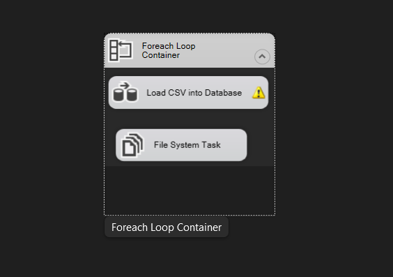
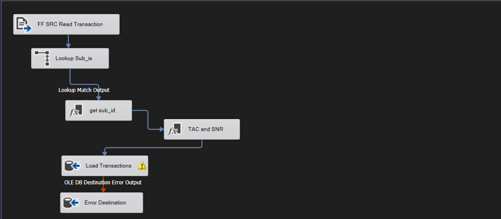

# 📡 Telecom Transactions ETL Pipeline (SSIS)

An end-to-end ETL project built with **SQL Server Integration Services (SSIS)**. A single package loops over raw telecom event files (pipe-delimited CSVs), enriches each record with a subscriber ID from a reference dimension, derives the device's TAC and SNR from the IMEI, and loads the result into a **SQL Server** data warehouse. Rows that fail to load are redirected to an error table instead of being lost.

---

## Table of Contents

- [Overview](#overview)
- [Architecture](#architecture)
- [Tech Stack](#tech-stack)
- [Repository Structure](#repository-structure)
- [SSIS Package Design](#ssis-package-design)
- [Data Model](#data-model)
- [Source Data](#source-data)
- [Getting Started](#getting-started)
- [Usage](#usage)
- [Known Limitations & Future Improvements](#known-limitations--future-improvements)

---

## Overview

Telecom networks generate a constant stream of events (for example, a subscriber's device connecting to a cell tower). Raw feeds are rarely clean: IMSIs and IMEIs go missing, cell and LAC values are blank, and timestamps are incomplete.

The `Load Data` package:

1. Iterates over every `*.csv` file in the source folder (**Foreach Loop Container**).
2. Copies each file into a `processed files` folder (**File System Task**).
3. Reads the file and looks up each IMSI in `dim_imsi_reference` (**Lookup**).
4. Replaces missing subscriber IDs with the default `-99999` (**Derived Column**).
5. Splits the IMEI into **TAC** and **SNR** (**Derived Column**).
6. Loads rows into `fact_transaction`; rows rejected by the destination go to `error_destination_output`.

## Architecture

```
Foreach Loop Container  (*.csv in Source Files)
│
├── File System Task ........... copy current file → "processed files" folder
│
└── Data Flow Task: "Load CSV into Database"

      FF SRC Read Transaction      (Flat File Source, pipe-delimited)
                │
                ▼
      Lookup Sub_is                (dim_imsi_reference on imsi)
                │ match output (no-match rows → NULL subscriber_id)
                ▼
      get sub_id                   (Derived Column: NULL → -99999)
                │
                ▼
      TAC and SNR                  (Derived Column: split imei)
                │
                ▼
      Load Transactions            (OLE DB Destination → fact_transaction)
                │ error output (Redirect row)
                ▼
      Error Destination            (OLE DB Destination → error_destination_output)
```

   
   

## Tech Stack

| Layer | Technology |
|-------|-----------|
| ETL tool | SQL Server Integration Services (SSIS) |
| IDE | Visual Studio with SQL Server Integration Services Projects extension |
| Data warehouse | Microsoft SQL Server (Express) |
| Provider | MSOLEDBSQL (OLE DB Driver for SQL Server) |

## Repository Structure

```
.
├──SQL Queries/
├    ├──Create_database.sql        # Creates SSIS_Telecom_DB, fact_transaction, error_destination_output
├     ├── Create_dim_imsi.sql        # Creates and populates dim_imsi_reference (IMSI → subscriber_id)
├── Load_Data.dtsx             # The SSIS package
├── Source Files/              # Raw input files (*.csv)
│   ├── 01_clean_data.csv
│   ├── 02_clean_data_with_null.csv
│   ├── 03_sample_data.csv
│   ├── batch_01_file_01.csv … batch_01_file_05.csv
│   └── batch_02_file_01.csv … batch_02_file_05.csv
└── processed files/           # Files copied here after each iteration
```

## SSIS Package Design

### Connection managers

| Name | Type | Purpose |
|------|------|---------|
| `Source files` | Flat File | Pipe-delimited file with a header row. Its connection string is set dynamically from `User::full_path`, so it points at whichever file the loop is processing. |
| `processed files` | File (folder) | Destination folder for the File System Task |
| `Telecom_Database` | OLE DB | `localhost\SQLEXPRESS`, database `SSIS_Telecom_DB`, Windows authentication |

### Variables

| Variable | Description |
|----------|-------------|
| `FF_src_file_name` | Current file name without extension (set by the Foreach Loop) |
| `file_extention` | `.csv` |
| `folder_path` | Path of the source folder |
| `full_path` | Expression: `folder_path + FF_src_file_name + file_extention` |

### Control flow

- **Foreach Loop Container**: Foreach File enumerator over the source folder with the file spec `*.csv`, non-recursive. It returns the file name only (no extension or folder) into `FF_src_file_name`.
- **File System Task**: copies the file at `User::full_path` to the `processed files` folder, overwriting if it already exists.
- **Data Flow Task `Load CSV into Database`**: described below.

### Data flow

| Component | Type | What it does |
|-----------|------|--------------|
| `FF SRC Read Transaction` | Flat File Source | Reads `id` (int), `imsi` (string), `imei` (string), `cell` (int), `lac` (int), `event_type` (string), `event_ts` (date) |
| `Lookup Sub_is` | Lookup | Query `select * from dim_imsi_reference`, matched on `imsi`. Lookup failures are ignored on the match output, so unmatched rows continue with a `NULL` subscriber ID. |
| `get sub_id` | Derived Column | `subscriber_id = ISNULL(subscriber_id) ? -99999 : subscriber_id` |
| `TAC and SNR` | Derived Column | `TAC = (ISNULL(imei) \|\| LEN(imei) < 14) ? "-99999" : SUBSTRING(imei,1,8)`<br>`SNR = (ISNULL(imei) \|\| LEN(imei) < 14) ? "-99999" : SUBSTRING(imei,9,14)` |
| `Load Transactions` | OLE DB Destination | Fast load into `[dbo].[fact_transaction]` (`TABLOCK`, `CHECK_CONSTRAINTS`). The input error disposition is **Redirect row**. |
| `Error Destination` | OLE DB Destination | Receives redirected rows into `[dbo].[error_destination_output]`, including the SSIS `ErrorCode` and `ErrorColumn`. |

### Business rules at a glance

| Rule | Behaviour |
|------|-----------|
| Unknown IMSI | `subscriber_id = -99999` |
| Missing or short IMEI (fewer than 14 characters) | `TAC = SNR = "-99999"` |
| Rows rejected on insert (for example a `NULL` in a `NOT NULL` column such as `imsi`, `cell`, `lac` or `event_ts`, or a data-type error) | Redirected to `error_destination_output` |

## Data Model

### `fact_transaction`

| Column | Type | Description |
|--------|------|-------------|
| `id` | `int identity` | Surrogate primary key |
| `transaction_id` | `int` | Original event ID from the source file |
| `imsi` | `varchar(9)` | International Mobile Subscriber Identity |
| `subscriber_id` | `int` | Looked up from `dim_imsi_reference` |
| `tac` | `varchar(8)` | Type Allocation Code (first 8 digits of the IMEI) |
| `snr` | `varchar(6)` | Serial number (remaining IMEI digits) |
| `imei` | `varchar(14)` | Device identifier |
| `cell` | `int` | Cell tower ID |
| `lac` | `int` | Location Area Code |
| `event_type` | `varchar(1)` | Type of network event |
| `event_ts` | `datetime` | Event timestamp |

### `dim_imsi_reference`

| Column | Type | Description |
|--------|------|-------------|
| `id` | `int identity` | Primary key |
| `imsi` | `varchar(9)` | IMSI |
| `subscriber_id` | `int` | Subscriber identifier |

### `error_destination_output`

Holds rejected records with the SSIS `ErrorCode` and `ErrorColumn` for troubleshooting.

## Source Data

Files are **pipe-delimited (`|`)** with the columns:

```
id | imsi | imei | cell | lac | event_type | event_ts
```

| File(s) | Purpose |
|---------|---------|
| `01_clean_data.csv` | Baseline sample of well-formed data |
| `02_clean_data_with_null.csv` | Data with missing values, to test null handling |
| `03_sample_data.csv` | Deliberately dirty data (non-numeric IDs such as `1@` and `text`, invalid event type `i`, missing fields) |
| `batch_01_file_01–05.csv`, `batch_02_file_01–05.csv` | Production-style batches |

## Getting Started

### Prerequisites

- Microsoft SQL Server (the package targets `localhost\SQLEXPRESS`)
- Visual Studio with the **SQL Server Integration Services Projects** extension
- SQL Server Management Studio (SSMS), recommended

### Database setup

Run the scripts in this order:

1. `Create_database.sql`: creates the database, `fact_transaction` and `error_destination_output`
2. `Create_dim_imsi.sql`: creates and seeds `dim_imsi_reference`

### Package setup

1. Open the project containing `Load_Data.dtsx` in Visual Studio.
2. Update the paths, which are currently set to a local drive:
   - Variable `folder_path` → your `Source Files` folder (keep the trailing `\`)
   - Foreach Loop Container → enumerator folder
   - Connection manager `processed files` → your output folder
3. Update the `Telecom_Database` connection manager if your server is not `localhost\SQLEXPRESS`.

## Usage

Run the package from Visual Studio (**Start**), or deploy it to the SSIS Catalog and run it from SSMS. Then verify the load:

```sql
SELECT COUNT(*) FROM fact_transaction;
SELECT COUNT(*) FROM error_destination_output;

-- Records that could not be matched to a subscriber
SELECT COUNT(*) FROM fact_transaction WHERE subscriber_id = -99999;
```

## Known Limitations & Future Improvements

- **Validation is destination-driven**: rows are rejected only when the insert fails. Adding a Conditional Split for explicit rules (valid event types, non-numeric IDs) would make rejections more precise.
- **Hard-coded paths**: move folder and server settings into project parameters.
- **Planned**: logging, SQL Agent scheduling, and an SSIS Catalog deployment.


---

*Built as a hands-on data engineering project covering SSIS control flow, data flow, lookups and error handling.*
